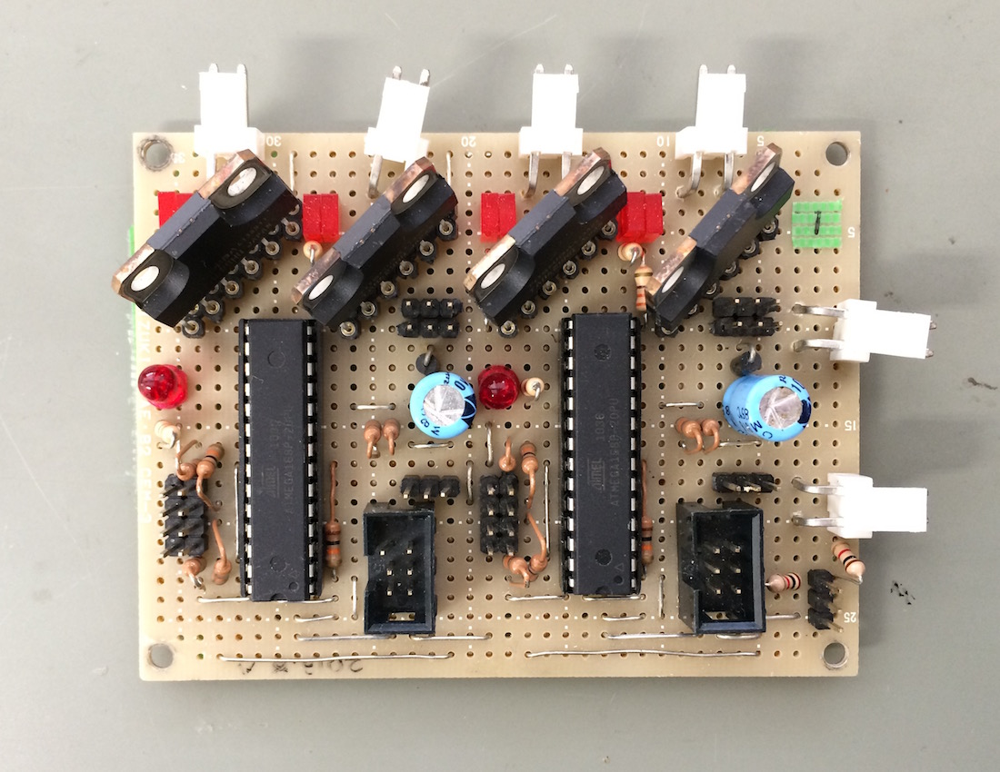

# 4chMotorDriver
４つのモータを制御する基板

## IO
- PWM入力 x4 (制御信号)
- ディジタル入力 x4 (リミットスイッチ)
- DCモータ出力 x4 個分
- シリアル通信ポート x2
- AVR ISP 書き込みポート x2

## 仕様
[2ch基板](https://github.com/RokkoOroshi/2chMotorDriver)を一つの基板上に二つ並べただけ

TPIPのPWM信号を入力に取り、そのデューティ比に応じて出力が変わる

デューティ比 50%でストップするはず

ディジタル入力をHighにすると対応するモータの出力が停止する

## TODO

- Atmel Studio Project/ Linux等用Makefile を作る
- プログラムのリファクタリング
